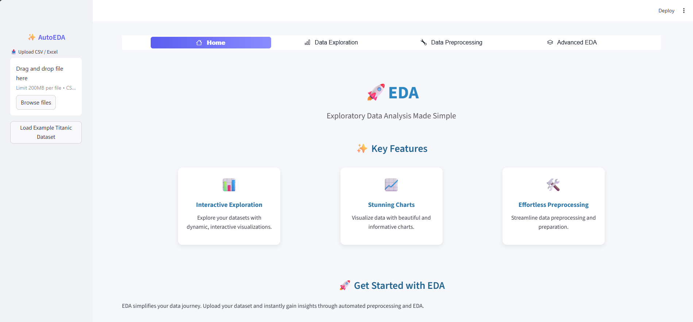
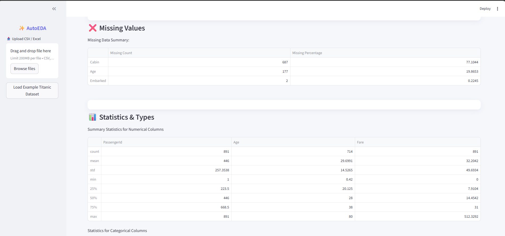
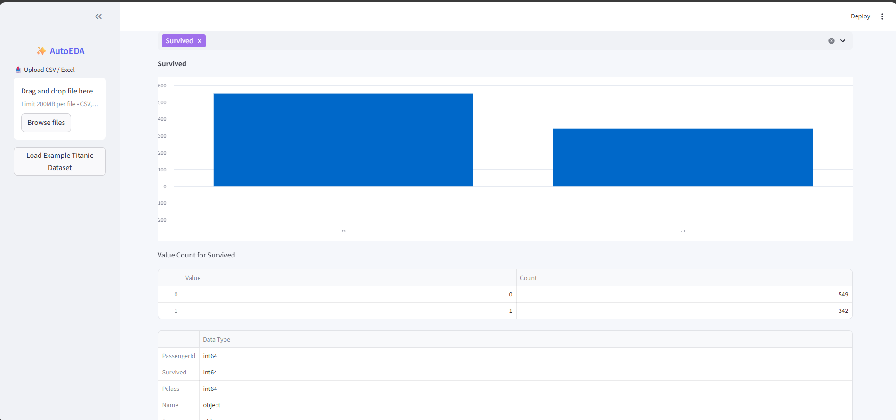
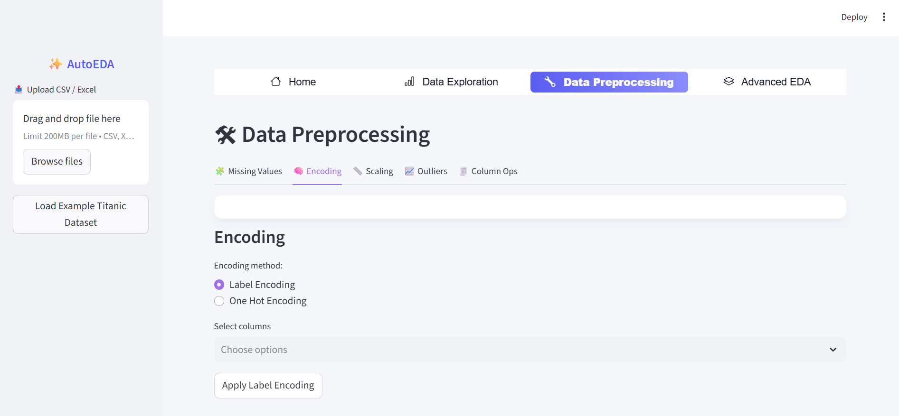
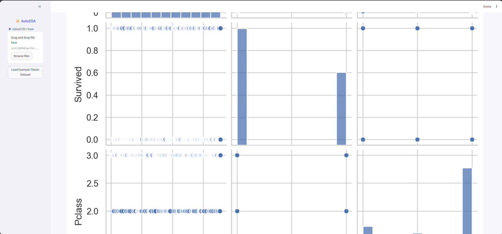

# EDA:Exploratory Data Analysis

<!--  -->

EDA is a Python application designed to streamline the process of Exploratory Data Analysis (EDA) for data scientists, analysts, and anyone working with data. EDA is a crucial step in understanding your dataset, finding patterns, and preparing data for further analysis.EDA simplifies this process by providing an interactive web-based platform to explore, visualize, and preprocess your data effortlessly.


## Preview






This is the home screen of the web application. From here, you can upload any dataset you want and perform Exploratory Data Analysis right through the web.


## Key Features

- Dataset Overview: Quickly load and preview your dataset, understand its structure, and check for missing data.

- Data Exploration and Visualization: Explore individual features, visualize their distributions, and analyze relationships between variables. Create charts, scatter plots, and correlation heatmaps with ease.

- Automated Data Preprocessing: Upcoming feature! Automate data preprocessing steps, including handling missing data, encoding categorical variables, scaling, and more.


## Why AutoEDA?

- Efficiency: AutoEDA automates routine EDA tasks, saving you time and effort.

- Interactivity: Visualize your data interactively to gain insights quickly.

- User-Friendly: No coding required. All tasks can be performed using the user-friendly web interface.

## Current Progress

**Dataset Overview:** Users can load and preview their datasets, access basic dataset statistics, and check for missing data.

**Data Exploration and Visualization:** Users can explore numerical and categorical features, create histograms, scatter plots, and other visualizations.

**Data Preprocessing**: Users can now perform data preprocessing tasks, including handling missing data, encoding categorical variables,feature scaling, identifying and handling outliers and more, directly from the web interface. This streamlines the data preparation process and saves time.
## Roadmap

- Make sure you have Python 3 installed.

- Clone this repository to your local machine.

- Open your command line or terminal.

- Navigate to the project directory.

- Run the following command to install the required Python libraries:

```sh 
pip install -r requirements.txt
```

- To start the application, just run the following line in terminal

```sh
streamlit run main.py
```

This will run the web application on your default web browser


